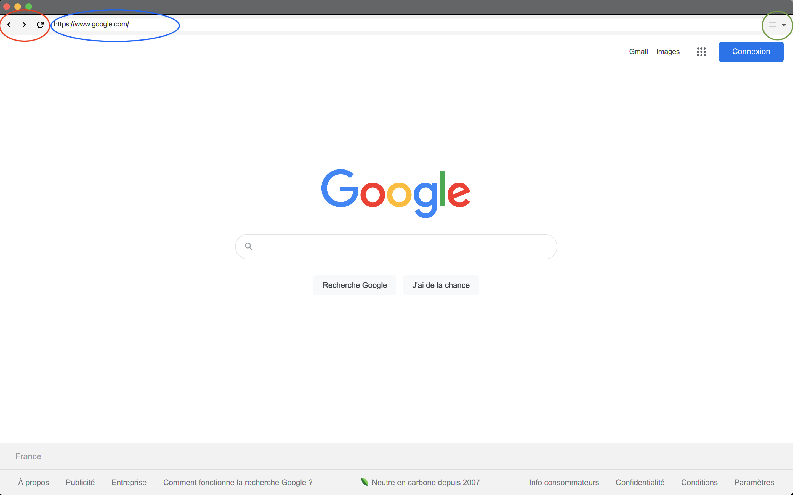
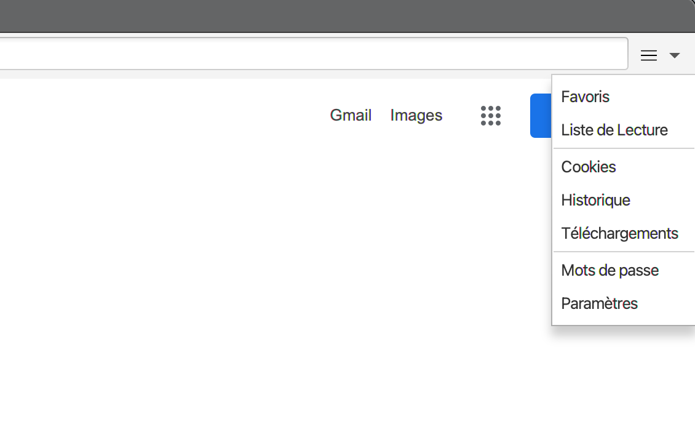
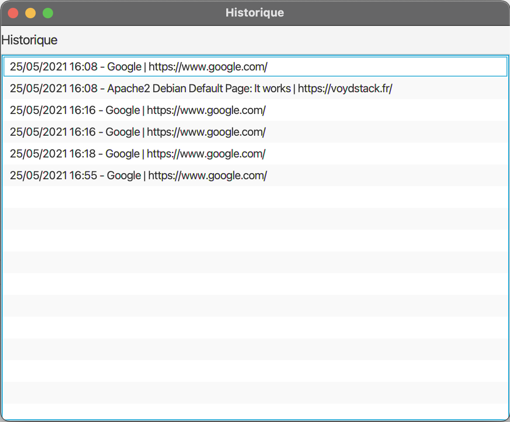

#### Simon Janda, Adrien Caubel, Guillaume Chaudon, Simon Moulin, Victor Nanche

---

# Navigateur - Manuel utilisateur

## Démarrage de l'application

Une fois l'application lancé vous arrivez sur la page d'accueil :

La page par défaut est : https://www.google.com

De cette page plusieurs options s'offre à vous :

- [Faire des recherches ou accèder à des pages](###Recherches) (**rouge**)
- [Naviguer entre les pages](###Naviguer) (**bleu**)
- [Accèder au Menu](###Menu) (**vert**)

### Recherche

Avec ce naviguateur vous pouvez accèder à une page depuis un url du type :

- http(s)://www.site.com
- site.com

Mais vous pouvez aussi faire des recherches par mot clés en les tapant dans la barre de recherche.

### Naviguer

3 boutons sont disponible respectivement :

- `<` Permet de revenir à la page qui se situe en précédemment  dans l'historique de navigation
- `>` Permet de revenir à la page qui se situe en suivant dans l'historique de navigation
- `r` Permet de faire recharger la page

### Menu

Différent menus sont accessibles:

- [Favoris](####Favoris) (En développement)
- [Liste de lecture](####Liste de lecture) (En développement)
- [Cookies](####Cookies) (En développement)
- [Historique](####Historique)
- [Mots de passe](####Mdp) (En développement)
- [Paramètres](#Paramètres) (En développement)

#### Historique

Cette fenêtre permet de visualiser l'historique de navigation.

